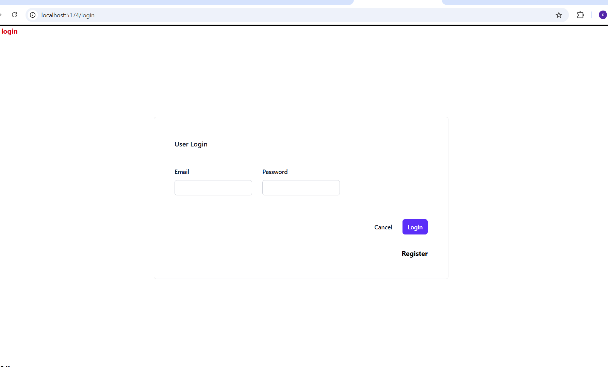
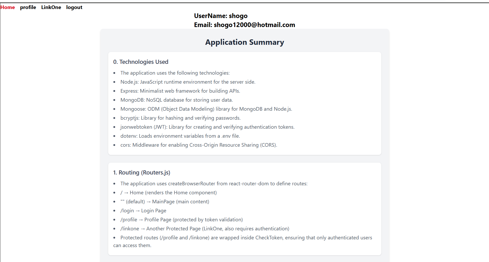

0. Technologies Used
The application uses the following technologies:
Node.js: JavaScript runtime environment for the server side.
Express: Minimalist web framework for building APIs.
MongoDB: NoSQL database for storing user data.
Mongoose: ODM (Object Data Modeling) library for MongoDB and Node.js.
bcryptjs: Library for hashing and verifying passwords.
jsonwebtoken (JWT): Library for creating and verifying authentication tokens.
dotenv: Loads environment variables from a .env file.
cors: Middleware for enabling Cross-Origin Resource Sharing (CORS).

1. Routing (Routers.js)
The application uses createBrowserRouter from react-router-dom to define routes:
/ → Home (renders the Home component)
"" (default) → MainPage (main content)
/login → Login Page
/profile → Profile Page (protected by token validation)
/linkone → Another Protected Page (LinkOne, also requires authentication)
Protected routes (/profile and /linkone) are wrapped inside CheckToken, ensuring that only authenticated users can access them.

2. Token Validation (CheckToken.js)
Uses Redux to retrieve the stored user token.
If the token is missing or invalid, redirects the user to the Login Page.
Calls axios.get("/users/verify-token") to verify if the token is valid.
If verification is pending, shows a 'Verifying token...' message.
If verification fails, redirects to the Login Page.
If verification succeeds, renders the requested protected page.

3. Home Component (Home.js)
Displays the Navigation menu at the top.
Uses <Outlet /> to render child routes dynamically.
Shows a footer message at the bottom.

4. Login Form (FormLogin.js)
Uses Redux dispatch to store user data (setUser).
Calls axios.post("/auth/login") to authenticate the user.
If successful:
- Stores the token, username, and email in Redux.
- Redirects to the Profile Page (/profile).
If authentication fails, displays an error message.

5. Registration Form (FormRegister.js)
Calls axios.post("/auth/register") to create a new user.
Displays an error message if registration fails.
Does not automatically log in the user after registration.

6. Redux User State (userSlice.js)
Stores user authentication data (token, username, email).
setUser: Saves user data after login.
logout: Clears user data when logging out.

BACKEND GIT
https://github.com/shogo12000/backendlogin.git

